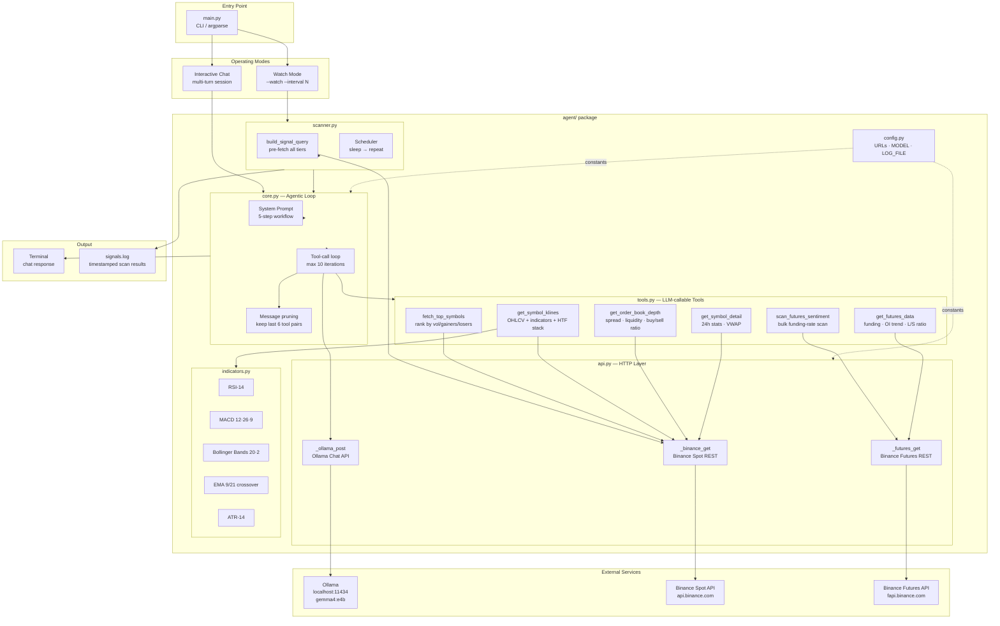
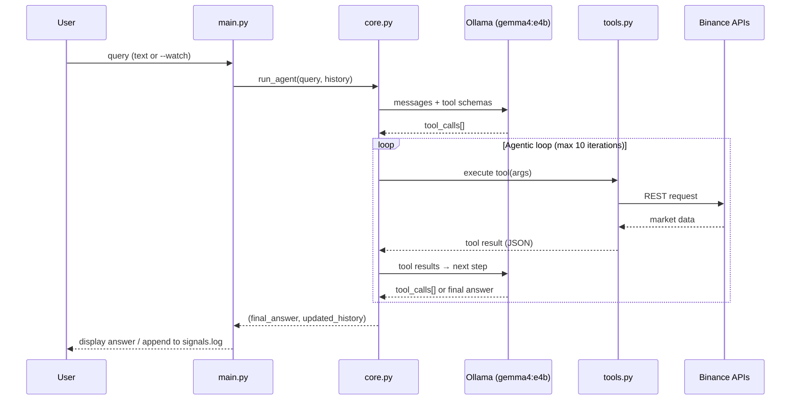

# Binance Symbol Scout Agent

> **Experimental Project** — This is a research sandbox for exploring the autonomous tool-calling capabilities of local LLMs running via [Ollama](https://ollama.com). It is not production software and should not be used for real trading decisions.

A local AI agent that scans Binance spot and perpetual futures markets in real time, computes technical indicators, and surfaces trading signals — used here as a complex, real-world task to stress-test how well small local models (e.g. `gemma4:e4b`) can reason, plan multi-step tool calls, and produce structured analysis without any cloud dependencies.

---

## What is this testing?

This project uses cryptocurrency market analysis as a demanding benchmark for local LLM reasoning. The goal is to observe and evaluate:

- **Autonomous tool selection** — can the model decide which tools to call and in what order, without being told?
- **Multi-step planning** — does it correctly chain `fetch_top_symbols → get_symbol_klines → get_futures_data → get_order_book_depth` without hand-holding?
- **Structured output quality** — does it extract and interpret numeric indicators (RSI, MACD, funding rate) correctly from raw JSON?
- **Context management** — how does it behave as conversation history grows across multiple turns?
- **Local model limits** — where do small models hallucinate, skip steps, or fail to follow the system prompt?

The Binance domain was chosen because it provides a free, real-time, public API with rich structured data — giving the model plenty of grounding material without requiring any credentials.

---

## Features

- **Live market data** — pulls directly from Binance public REST APIs (no API key required)
- **Technical analysis** — RSI-14, MACD(12,26,9), Bollinger Bands(20,2), EMA 9/21 crossover, ATR(14)
- **Multi-timeframe confirmation** — automatically checks higher TFs (15m→1h→4h→1d) in parallel and reports `stack_aligned`
- **Futures market structure** — funding rate, open interest trend (8h), long/short ratio
- **Order book depth** — bid/ask spread and liquidity check before finalising a signal
- **Agentic tool loop** — the LLM decides which tools to call and in what order; you just ask a question
- **Continuous scanner** — `--watch` mode scans all three market-cap tiers every N minutes and logs signals to `signals.log`
- **Multi-turn chat** — conversation history is preserved across questions in the same session
- **Zero cloud dependencies** — runs entirely locally via Ollama; no OpenAI, no LangChain

---

## Architecture

```
main.py               CLI entry point
agent/
├── config.py         Constants (URLs, model name, log file)
├── api.py            HTTP helpers for Binance REST + Ollama chat API
├── indicators.py     Pure-Python technical indicators (no numpy/pandas)
├── tools.py          Tool implementations + JSON schema for the LLM
├── core.py           Agentic loop, system prompt, message pruning
└── scanner.py        Continuous signal scanner and signal query builder
```

### System Architecture Diagram



### Agentic Query Workflow



The agent follows a five-step workflow on every query:

```
Discover  →  Drill down  →  Market structure  →  Liquidity  →  Report
   │               │                │                  │
fetch_top_    get_symbol_      get_futures_     get_order_book_
 symbols       klines            data              depth
```

---

## Requirements

- Python 3.10+
- [Ollama](https://ollama.com) running locally with the `gemma4:e4b` model pulled

```bash
ollama pull gemma4:e4b
```

No third-party Python packages are required — only the standard library.

---

## Installation

```bash
git clone <your-repo-url>
cd ai
python -m venv .venv
source .venv/bin/activate   # Windows: .venv\Scripts\activate
```

---

## Usage

### Interactive chat

```bash
python main.py
```

Pick a numbered example or type any free-form question:

```
  1. What are the top 5 momentum plays right now?
  2. Find the biggest gainers with high volume today
  3. Which USDT pairs have the tightest spreads and best liquidity?
  4. Show me coins that look oversold (low RSI) with rising volume
  5. Compare SOL and AVAX — which has better momentum right now?
  6. Find coins with Bollinger squeeze setups (low bandwidth) ready to break out
  7. Which symbols have bullish MACD crossovers and negative funding rates?
```

**Session commands:**

| Input | Action |
|-------|--------|
| `1`–`7` | Run that numbered example |
| `/reset` | Clear conversation history and start fresh |
| `exit` / `quit` / `q` | Quit |

### Continuous signal scanner

```bash
python main.py --watch                  # scan every 5 minutes (default)
python main.py --watch --interval 15   # scan every 15 minutes
```

Each scan pre-fetches all three market-cap tiers (large / mid / low), asks the agent to pick the 3 best signals, and appends results to `signals.log`.

---

## Tools available to the agent

| Tool | Description |
|------|-------------|
| `fetch_top_symbols` | Rank Binance pairs by volume, gainers, losers, or trade count; filter by market-cap tier |
| `get_symbol_klines` | OHLCV candles + RSI, MACD, Bollinger Bands, EMA crossover, ATR, momentum; optional HTF stack |
| `get_order_book_depth` | Bid/ask spread, bid/ask liquidity, buy/sell ratio |
| `get_symbol_detail` | 24h price stats: VWAP, high/low, volume, trade count |
| `scan_futures_sentiment` | Bulk-scan all USDT perps ranked by funding rate (crowded shorts/longs detection) |
| `get_futures_data` | Per-symbol: funding rate, OI 8h trend, global long/short ratio |

---

## Indicator reference

| Indicator | Signal interpretation |
|-----------|----------------------|
| RSI-14 | < 30 oversold · > 70 overbought |
| MACD histogram | `rising=true` = bullish momentum shift; negative value = bearish |
| Bollinger `pct_b` | > 1.0 breakout above upper band · < 0 below lower · `bandwidth` < 0.05 = squeeze |
| EMA 9/21 | `just_crossed=true` + `bullish=true` + rising volume = strong entry signal |
| ATR% | Normalised volatility — use for stop-loss sizing |
| `stack_aligned` | `true` only when all confirmation TFs agree with primary EMA → HIGH confidence |
| Funding rate | < −0.01% crowded shorts (squeeze risk) · > 0.03% crowded longs |
| OI trend | Rising OI + rising price = trend confirmed · rising OI + falling price = distribution |
| L/S ratio | > 2.5 crowded long · < 0.5 crowded short |

---

## Configuration

Edit `agent/config.py` to change the model or endpoints:

```python
OLLAMA_URL          = "http://localhost:11434/api/chat"
BINANCE_URL         = "https://api.binance.com"
BINANCE_FUTURES_URL = "https://fapi.binance.com"
MODEL               = "gemma4:e4b"
LOG_FILE            = "signals.log"
```

---

## Experimental Notes

Observations and known limitations when running with small local models:

- Models smaller than ~7B parameters often skip tool calls and answer from training data instead
- Multi-step chains of 4+ tools work reliably with `gemma4:e4b` but degrade with weaker models
- Context pruning (keeping last 6 tool pairs) is critical — models lose coherence without it
- `stack_aligned` multi-timeframe logic is the hardest for models to reason about correctly
- Structured JSON output quality varies significantly between model families

Feel free to swap the model in `agent/config.py` and compare behaviour.

---

## Disclaimer

This project is for **experimental and educational purposes only**. It does not execute trades, manage funds, or provide financial advice. Market data is used solely as a test input for local LLM evaluation.
